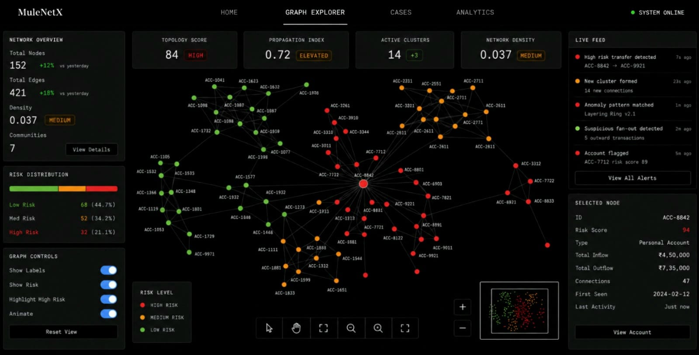

<div align="center">

```
███╗   ███╗██╗   ██╗██╗     ███████╗███╗   ██╗███████╗████████╗██╗  ██╗
████╗ ████║██║   ██║██║     ██╔════╝████╗  ██║██╔════╝╚══██╔══╝╚██╗██╔╝
██╔████╔██║██║   ██║██║     █████╗  ██╔██╗ ██║█████╗     ██║    ╚███╔╝ 
██║╚██╔╝██║██║   ██║██║     ██╔══╝  ██║╚██╗██║██╔══╝     ██║    ██╔██╗ 
██║ ╚═╝ ██║╚██████╔╝███████╗███████╗██║ ╚████║███████╗   ██║   ██╔╝ ██╗
╚═╝     ╚═╝ ╚═════╝ ╚══════╝╚══════╝╚═╝  ╚═══╝╚══════╝   ╚═╝   ╚═╝  ╚═╝
```

**Graph-powered financial crime visualization and risk propagation platform**

*Transaction topology. Risk propagation. Suspicious lines connecting to other suspicious lines.*

---

[](https://reactjs.org/)
[](https://d3js.org/)
[](https://vitejs.dev/)
[](https://nodejs.org/)
[](https://python.org/)
[](https://expressjs.com/)

</div>

---

## The Problem

A table of transactions tells you what happened. A transaction topology graph tells you what's *structurally happening* — who connects to whom, where flow concentrates, what the shape of the activity implies. Most financial crime tools give you the table. Money doesn't move randomly. Layering schemes produce long chains. Smurfing creates dense funnels of small-value inputs converging on single destinations. Fan-out attacks radiate from one source to dozens of accounts in burst patterns. These shapes are recognizable — if you render them at the right level of abstraction.

MuleNetX is a graph-powered intelligence dashboard that makes these shapes visible: force-directed, zoomable, edge-weighted, risk-propagated, and forensically legible.

---

## Visual Showcase

### India Risk Heatmap — National Transaction Intelligence

> Geographic risk distribution across states, visualized as a heat-graded chloropleth with live alert feeds and per-state drill-down.


Suspicious volume of **₹1.3Cr** tracked across **11,842 accounts** and **23,761 transactions**. Maharashtra leads by volume at ₹28.5L. Tamil Nadu sits at a risk score of 73/100 — 17 accounts, 4 active cases, ₹7.4L in flagged volume. The map encodes risk density through color; the panels encode operational context through data.

---

### Graph Explorer — Force-Directed Transaction Topology

> The visual center of the system. 152 nodes, 421 edges, rendered as a live force-directed graph with real-time risk propagation and cluster detection.



The topology score is **84 (HIGH)**. Propagation index is **0.72 (ELEVATED)**. 14 active clusters, network density at 0.037. The graph isn't decorative — every node position, edge weight, and color encodes a structural fact about the transaction network. Red is high-risk, orange is medium, green is low. The selected node (ACC-8842, risk score 94) shows ₹4,50,000 inflow against ₹7,35,000 outflow across 47 connections — structurally consistent with a layering intermediary.

---

### Cases Dashboard — Investigative Case Management

> Active investigation tracking with risk score breakdown, fraud typology classification, and investigator assignment.


247 total cases — 23 high-risk, 68 under investigation, 156 closed. Layering is the dominant typology at 36%, followed by structuring at 25.1%. The case table surfaces the highest-priority items with enough context (risk score, investigator, last activity, fraud type) to triage without opening anything. The risk score distribution bar at the bottom is visual triage.

---

### Analytics — Temporal Trend Intelligence

> Case and alert trends over time, fraud type distribution, alert reason breakdown, and resolution performance metrics.


47 total cases, 156 alerts generated, 29 high-risk alerts. False positive rate at 8.6% — down 2.4% from the previous period. Average resolution time 18.4h, down 15%. Layering transactions are the top alert driver at 26.9%, followed by large cash deposits and structuring. The charts show daily granularity across a 30-day window; the performance summary shows period-over-period delta.

---

### Live Terminal Feed — System Operational Log

> Real-time streaming log of system events, alerts, and graph engine activity — the operational layer made visible.


---

## System Architecture

```
┌─────────────────────────────────────────────────────────────────────┐
│                          FRONTEND LAYER                             │
│                                                                     │
│   BootSequence → App Shell → GraphCanvas + SystemPanel + EventFeed  │
│                              TerminalFeed + Analytics + Cases       │
└──────────────────────────────┬──────────────────────────────────────┘
                               │ HTTP / REST
┌──────────────────────────────▼──────────────────────────────────────┐
│                           API LAYER                                 │
│                                                                     │
│             server.js  ←→  fetchGraph.js                           │
└──────────────────────────────┬──────────────────────────────────────┘
                               │
┌──────────────────────────────▼──────────────────────────────────────┐
│                          DATA LAYER                                 │
│                                                                     │
│        graph.json          transactions.json                        │
│              ↑                     ↑                                │
│        export_graph.py      anomaly_scan.py + risk_score.py        │
└──────────────────────────────┬──────────────────────────────────────┘
                               │
┌──────────────────────────────▼──────────────────────────────────────┐
│                       GRAPH ENGINE LAYER                            │
│                                                                     │
│       topology.js    centrality.js    propagation.js               │
└──────────────────────────────┬──────────────────────────────────────┘
                               │
┌──────────────────────────────▼──────────────────────────────────────┐
│                      FRAUD TEMPLATE LAYER                           │
│                                                                     │
│       fan_out.yaml    layering_ring.yaml    smurfing.yaml           │
└─────────────────────────────────────────────────────────────────────┘
```

The architecture is deliberately layered. The frontend is concerned with rendering and interaction. The API layer is concerned with data access, not computation. The analysis scripts run as preprocessing steps — they write outputs the server then serves, rather than running inline with requests. The graph engine is the computational core: topology analysis, centrality computation, and risk propagation all live here, independent of the UI.

---

## Graph Theory, Applied

Financial crime networks have structure. Understanding that structure requires a vocabulary.

**Nodes** are entities — bank accounts, wallets, shell companies, payment intermediaries. **Edges** are transactions — directional, weighted by value, timestamped. **Topology** is the shape of the whole: how densely connected, where the clusters form, what the structural layout implies about intent.

Three centrality measures matter most in this context:

- **Betweenness centrality** — how often a node sits on the shortest path between other nodes. High betweenness in a transaction graph means structural importance: this account is a routing point, not an endpoint. That's suspicious.
- **Degree centrality** — how many direct connections a node has. Unexpectedly high degree (for an account type that shouldn't have it) is anomalous.
- **Eigenvector centrality** — not just how many connections, but how important those connections are. Being connected to high-centrality nodes amplifies your own score.

**Propagation** models contagion: if node A is compromised, how does that risk travel through the network? MuleNetX implements a weighted diffusion model across edges — risk attenuates with graph distance but accumulates through high-centrality paths. The result is a heat signature: which parts of the network are downstream of a flagged entity.

The fraud templates aren't illustrative. They're structurally generative — each YAML defines the mathematical constraints of its pattern, and the graph engine synthesizes networks that satisfy those constraints. The patterns look like money laundering because they were built according to the topology of money laundering.

---

## Fraud Topology Patterns

### Fan-Out

One source account distributes to a large number of destination accounts in a compressed time window. In the graph, this renders as a radial burst — a single high-degree hub with many outbound edges and low return flow. Diagnostic signal: degree asymmetry. The hub sends but rarely receives.

```yaml
# fan_out.yaml (abridged)
pattern: fan_out
source_accounts: 1
destination_accounts: 25-50
time_window_minutes: 15
amount_distribution: uniform_small
return_flow: none
```

### Layering Ring

Funds move through a sequence of intermediate accounts — often in a cycle or long chain — to obscure origin. The graph renders this as a winding path with minimal cross-connections. Diagnostic signal: long-path structure, low clustering coefficient, sequential timing.

```yaml
# layering_ring.yaml (abridged)
pattern: layering_ring
chain_length: 8-15
cycle_probability: 0.3
timing: sequential_delay
amount_decay: 0.02_per_hop
```

### Smurfing

Many distributed sources, each transacting below reporting thresholds, converging on a single destination. The graph renders this as a dense inverted funnel. Diagnostic signal: many low-value inputs, single high-value output node, source accounts with minimal prior activity.

```yaml
# smurfing.yaml (abridged)
pattern: smurfing
source_count: 30-80
per_transaction_ceiling: 99000
destination_accounts: 1-3
aggregation_window_hours: 48
```

---

## Component Breakdown

### Frontend — `dashboard/src/components/`

**`GraphCanvas.jsx`**
The visual core. Manages a D3.js force simulation inside a React component without letting the two rendering systems conflict — D3 owns the DOM within its canvas, React owns state coordination outside it. Nodes carry risk-encoded color. Edges carry transaction weight. The simulation is live: add a node or change an edge weight and the topology responds physically.

**`EventFeed.jsx`**
A chronological stream of synthetic transaction events: entity IDs, amounts, timestamps, risk flags. Rendered with CSS transitions to simulate genuine stream velocity. Functions as both atmosphere and operational context.

**`SystemPanel.jsx`**
Infrastructure metrics: node count, edge count, active alerts, analysis throughput. Gives the interface operational weight — this panel makes the dashboard feel like it's monitoring something real, because structurally, it is.

**`TerminalFeed.jsx`**
A scrolling log of system activity — graph computations, anomaly triggers, topology updates. This component does atmospheric and functional work simultaneously: it communicates what the system is doing while making the interface feel like a live intelligence feed.

**`App.jsx`**
Root orchestration. State management, data coordination, component composition. The component hierarchy is deliberately flat — no deep nesting, no prop-drilling pyramids. Everything renders from here.

---

### API Layer — `api/`

**`server.js`**
Lightweight Express server. Reads from the data layer, exposes graph data and transaction events as REST endpoints. Not a bottleneck. Not trying to be.

**`fetchGraph.js`**
Client-side HTTP abstraction. Components call this, not raw `fetch`. Keeps the data-fetching logic out of the rendering logic.

---

### Analysis Layer — `analysis/`

**`anomaly_scan.py`**
Statistical outlier detection on transaction data. Flags unusual amounts, high-velocity sequences, and structuring patterns. Outputs scored transactions with confidence values. Runs as a preprocessing step, not a live service.

**`risk_score.py`**
Assigns per-node risk scores based on transaction behavior and network position (centrality, connection type, flow asymmetry). Output is consumed by the frontend to color-code the graph visualization. The score is what makes the graph tell you where to look.

---

### Graph Engine — `graph_engine/`

**`topology.js`**
Structural analysis: connected components, path lengths, clustering coefficients, density. Gives you the shape of the network and tells you whether you're looking at a ring, a chain, a hub-and-spoke, or something with no clean name.

**`centrality.js`**
Computes betweenness, degree, and eigenvector centrality across the graph. Surfaces the nodes that are structurally important — the intersections, the routers, the entities everything flows through. In a laundering context, these are the interesting nodes.

**`propagation.js`**
Weighted diffusion simulation from a source node. Models how risk or compromise spreads through the network topology. Produces a gradient — not just "this node is flagged" but "here is how far the influence of this flagged node extends, and at what attenuation."

---

### Data Layer — `data/`

**`graph.json`**
The canonical data structure: a serialized directed graph with node metadata and edge weights. This is what the graph engine reads, what the analysis layer writes, and what the frontend ultimately renders.

**`transactions.json`**
Flat transaction records: source, destination, amount, timestamp, type. The raw material. The graph is derived from this; the event feed draws from this directly.

---

## Frontend Architecture Notes

The React/D3 integration in `GraphCanvas` deserves explanation because it's genuinely non-trivial. D3 wants to own the DOM. React wants to own the DOM. Running both naively produces conflicts — React rerenders destroy D3's mutation state; D3 mutations confuse React's reconciler.

The solution: D3 is given an SVG element reference and owns everything inside it. React manages everything outside — state, props, lifecycle. The component uses a `useEffect` hook to initialize the D3 simulation on mount and update it on prop changes, but never lets React attempt to reconcile the SVG contents. This is the correct pattern and it's not obvious until you've broken it a few times.

The component hierarchy is deliberately flat. `App.jsx` manages state. `GraphCanvas`, `EventFeed`, `SystemPanel`, and `TerminalFeed` are display components — they receive data, they render it. Only `GraphCanvas` has meaningful interaction logic (click, zoom, drag). Everything else is read-only.

---

## Backend Architecture Notes

The API layer is intentionally minimal. Express serves static JSON. The Python analysis scripts run as preprocessing — they transform `transactions.json` into scored outputs and write those outputs back to disk. The server reads from disk; it doesn't invoke Python at request time. This is the right tradeoff for this system. The interesting computation happens in the graph engine and the analysis scripts, both of which run offline against synthetic data. A production extension would replace the static JSON reads with database queries and schedule the Python scripts to run against live data feeds. The architecture accommodates this without requiring it.

---

## Project Structure

```
mulenetx/
├── dashboard/
│   └── src/
│       ├── components/
│       │   ├── GraphCanvas.jsx     # D3 force-directed graph renderer
│       │   ├── EventFeed.jsx       # Live transaction event stream
│       │   ├── SystemPanel.jsx     # Infrastructure status metrics
│       │   └── TerminalFeed.jsx    # System activity log
│       ├── App.jsx                 # Root orchestration layer
│       └── main.jsx                # Vite entry point
├── api/
│   ├── server.js                   # Express REST API
│   └── fetchGraph.js               # Client-side data fetching
├── analysis/
│   ├── anomaly_scan.py             # Statistical outlier detection
│   └── risk_score.py               # Per-node risk scoring
├── data/
│   ├── graph.json                  # Serialized directed graph
│   └── transactions.json           # Raw transaction records
├── database_framework/
│   └── export_graph.py             # Transaction → graph translation
├── graph_engine/
│   ├── topology.js                 # Structural graph analysis
│   ├── centrality.js               # Centrality metric computation
│   └── propagation.js              # Risk diffusion simulation
├── fraud_templates/
│   ├── fan_out.yaml                # Fan-out pattern definition
│   ├── layering_ring.yaml          # Layering ring pattern definition
│   └── smurfing.yaml               # Smurfing pattern definition
├── deploy/
│   └── docker-compose.yml          # Multi-container deployment config
└── .env.example                    # Environment variable template
```


---

## Technical Philosophy

Systems that visualize complexity should feel like they understand the complexity they're visualizing. MuleNetX was built around the graph as the primary analytical primitive. Every design decision — the force-directed layout, the risk propagation visualization, the centrality-weighted node coloring, the topology templates — exists to make the structural properties of transaction networks legible.

---

## Contributors

| Contributor | GitHub |
|-------------|--------|
| **Kumaran** | [@Kumaranshub](https://github.com/ckumuran) |
| **Sarvesh** | [@Sarvesh-Sarz](https://github.com/Sarvesh-Sarz) |
| **Partha** | [@DatGod920](https://github.com/DatGod920) |
| **Tawheed** | [@twhdd1201](https://github.com/twhdd1201) |

---

</div>
